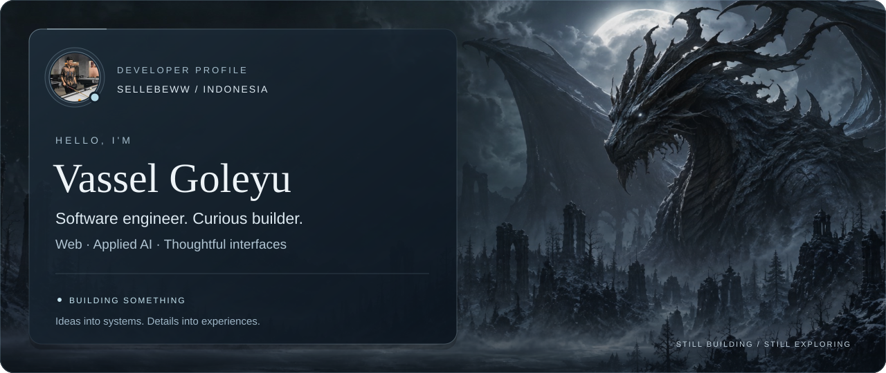
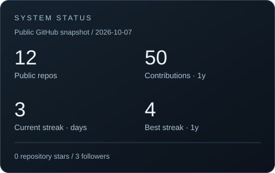
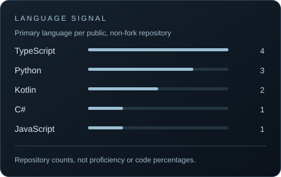
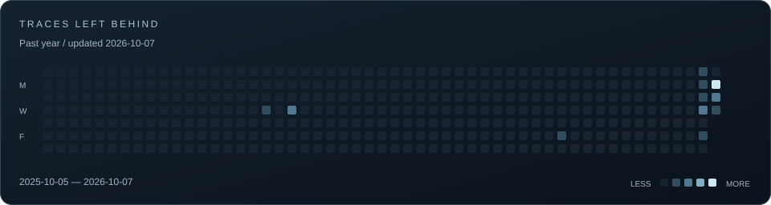
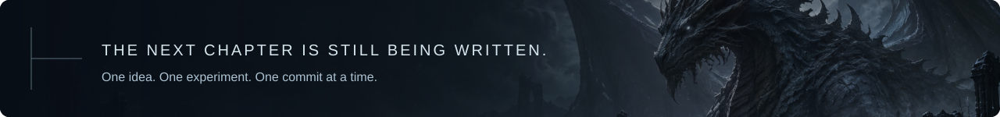

<picture>
  <source media="(max-width: 600px)" srcset="./assets/hero-mobile.svg">
  
</picture>

  <a href="#about-me">Profile</a> &nbsp; / &nbsp;
  <a href="#arsenal">Arsenal</a> &nbsp; / &nbsp;
  <a href="#artifacts">Artifacts</a> &nbsp; / &nbsp;
  <a href="#enter-the-signal">Contact</a>

<h1 align="center">Useful software. Thoughtful details.</h1>

  I'm <strong>Vassel Goleyu</strong>, a software engineer based in Indonesia. 
  I build for the web, experiment with AI, and care about how the two feel to use.

  <a href="https://vassel-nature-portfolio.vercel.app">Visit my portfolio ↗</a>
  &nbsp; · &nbsp;
  <a href="https://github.com/sellebeww?tab=repositories">Explore my repositories ↗</a>

01 / THE PERSON BEHIND THE CODE

## About me

I like the point where an idea becomes something you can actually use: a model that recognizes an image, an app that keeps working offline, or an interface that makes a complicated task feel simple.

My work moves between **web development**, **applied AI**, and **interface design**. Node.js is a familiar starting point; Python gives me room to experiment. Outside the browser, I'm curious about **PLC and automation**—another way to connect software with the real world.

> **Current focus**
>
> **Building** → [Tomato Vision](https://github.com/sellebeww/tomato-vision), exploring image classification with CNNs. 
> **Learning** → Deeper AI / LLM integration in web applications. 
> **Exploring** → Clearer design systems, offline experiences, and automation.

02 / TOOLS OF THE TRADE

## Arsenal

**Core languages** 
`TypeScript` · `JavaScript` · `Python` · `Kotlin` · `C#`

**Web & interfaces** 
`Node.js` · `React` · `Next.js` · `Tailwind CSS` · `Vite`

**AI & beyond the browser** 
`TensorFlow` · `CNNs` · `LLM integration` · `Android` · `Unity`

**Everyday tools** 
`Git` · `GitHub` · `Docker`

03 / SELECTED WORK

## Artifacts

A few things I've brought out of the workshop.

ARTIFACT 01 &nbsp; / &nbsp; COMPUTER VISION

### [Tomato Vision](https://github.com/sellebeww/tomato-vision)

Classifying tomato freshness from images with a convolutional neural network. A hands-on exploration of turning visual data into a useful prediction.

**Stack** — Python · TensorFlow · CNN 
**Status** — Public repository

[View artifact ↗](https://github.com/sellebeww/tomato-vision)

---

ARTIFACT 02 &nbsp; / &nbsp; OFFLINE SOFTWARE

### [Batch Aman](https://github.com/sellebeww/Batch-Aman)

An offline-first PWA for recording food batches. Built around keeping records available when a connection isn't. Default food-safety thresholds are not expert-verified.

**Stack** — TypeScript · PWA 
**Status** — Public prototype

[View artifact ↗](https://github.com/sellebeww/Batch-Aman)

---

ARTIFACT 03 &nbsp; / &nbsp; INTERFACE CRAFT

### [Vassel F&B Experience](https://github.com/sellebeww/Vassel-F-B-Experience)

Two distinct ordering experiences: an artisanal dining concept and a Japanese matcha / coffee bar. An exploration of how visual identity shapes a familiar flow.

**Stack** — React · TypeScript · Vite · Tailwind CSS 
**Status** — Live demo

[View artifact ↗](https://github.com/sellebeww/Vassel-F-B-Experience) &nbsp; · &nbsp; [Open experience ↗](https://vassel-f-b-experience.vercel.app/)

---

ARTIFACT 04 &nbsp; / &nbsp; INTERACTIVE SYSTEMS

### [GEPREK!](https://github.com/sellebeww/GEPREK-Project-Mata-Kuliah-Game-Development)

A 2D top-down ayam geprek business simulator. Balancing orders, time, and a growing food business—built for a Game Development course.

**Stack** — C# · Unity 
**Status** — Course project

[View artifact ↗](https://github.com/sellebeww/GEPREK-Project-Mata-Kuliah-Game-Development)

  <a href="https://github.com/sellebeww?tab=repositories">Continue through the archive →</a>

04 / TELEMETRY

## System status

  
  

### Activity log

<picture>
  <source media="(max-width: 600px)" srcset="./assets/activity-mobile.svg">
  
</picture>

Each square is a day of activity. [View the live contribution history ↗](https://github.com/sellebeww?tab=overview)

05 / OPEN A CONNECTION

## Enter the signal

Have an idea worth building, a question about a project, or an interesting problem? Find my work here.

**[GitHub ↗](https://github.com/sellebeww)** &nbsp; / &nbsp; **[Portfolio ↗](https://vassel-nature-portfolio.vercel.app)**

 

<picture>
  <source media="(max-width: 600px)" srcset="./assets/footer-mobile.svg">
  
</picture>

  <a href="https://github.com/sellebeww?tab=repositories">Keep exploring ↗</a> 
  Still building. Still learning.

