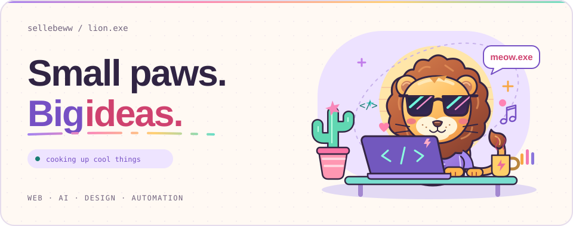

<picture>
  <source media="(max-width: 600px) and (prefers-color-scheme: dark)" srcset="./assets/tiger-arcade-mobile-dark.svg">
  <source media="(max-width: 600px)" srcset="./assets/tiger-arcade-mobile.svg">
  <source media="(prefers-color-scheme: dark)" srcset="./assets/tiger-arcade-dark.svg">
  
</picture>

  SOFTWARE ENGINEER &nbsp;·&nbsp; BASED IN INDONESIA 🇮🇩

<h1 align="center">Hey, I'm Vassel</h1>

  Building for the web, exploring AI, and caring about the little design details. 
  <em>Curious mind. Lion energy. A little bit of swagger.</em>

  <a href="https://github.com/sellebeww?tab=repositories">Explore my repos ↗</a>
  &nbsp;·&nbsp;
  <a href="https://github.com/sellebeww?tab=stars">Starred finds ↗</a>

---

### 🧑‍💻 A little about me

I'm **Vassel Goleyu**, a software engineer with a soft spot for **Node.js**, thoughtful **design systems**, and bringing **AI into web applications**. My curiosity also extends beyond the browser to **PLC & automation**.

I like connecting the dots between how things work and how they feel to use.

### 🔗 Connect with me

  
  
  

## Things I build with

#### 01 · Frontend

  
  
  
  
  
  
  
  
  

#### 02 · Backend

  
  
  
  
  
  

#### 03 · Mobile

  
  
  

#### 04 · Database & Tools

  
  
  
  
  
  
  
  
  
  
  
  

### 🌱 Currently growing

- **AI & LLMs** — exploring deeper integration in web applications.
- **Design** — learning how to make interfaces clearer and more thoughtful.
- **A little every day** — staying curious, one small experiment at a time.
